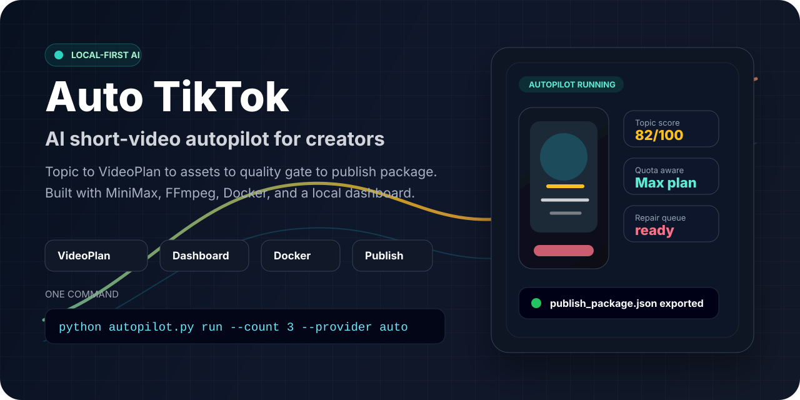
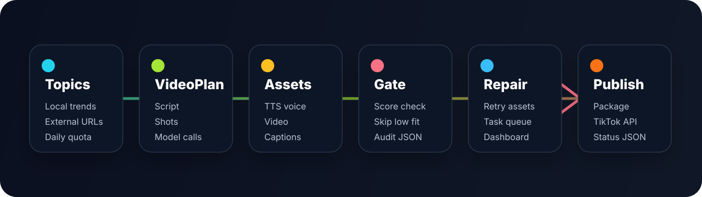

<p align="center">
  
</p>

<h1 align="center">Auto TikTok / 抖音 TikTok 自动短视频工厂</h1>

<p align="center">
  <strong>本地优先的抖音/TikTok AI 短视频自动生成与发布准备系统。</strong><br />
  从选题到结构化计划，从素材生成到质量门槛，从发布包导出到本地运维看板。
</p>

<p align="center">
  <a href="README.md">English</a> ·
  <a href="README.zh-CN.md">简体中文</a> ·
  <a href="docs/AUTOPILOT.md">Autopilot</a> ·
  <a href="docs/DEPLOYMENT.md">部署</a> ·
  <a href="docs/PROMOTION.md">推广</a>
</p>

<p align="center">
  <a href="https://github.com/yanzhi0922/auto-tiktok/actions/workflows/ci.yml"></a>
  
  
  
  
</p>

---

Auto TikTok 是一个偏产品化的短视频自动化工具箱。它可以从选题或热榜来源出发，生成可恢复的 `video_plan.json`，自动生成脚本、旁白、视频、字幕、封面、质量评分、发布包和运行报告，并通过本地 Dashboard 监控、修复和重新生成资产。

它不是一个单纯的“脚本生成器”。项目核心是稳定的 **VideoPlan**：每条内容都有结构化蓝图、模型调用计划、资产路径、质量分、配额审计和失败恢复路径。

## 为什么值得 Star

| 你的需求 | Auto TikTok 提供的能力 |
| --- | --- |
| 不想手工设计每条短视频 | Topic-to-video Autopilot：脚本、旁白、视频、字幕、封面、合成一条龙 |
| AI 生成失败后能恢复 | 每条内容都有 `video_plan.json` 与 `content_manifest.json` |
| 想知道每次运行发生了什么 | Dashboard、历史 run、配额快照、失败原因、任务队列和报告 |
| 不想浪费付费额度 | 质量门槛、评分阈值、按配额收敛数量、单资产修复 |
| 需要真实发布准备 | 默认导出人工发布包，可选 TikTok 官方发布 API 适配 |
| 希望像产品一样运行 | Docker、healthcheck、会话/CSRF、防日志泄露、备份、日志轮转、迁移 |

## 一分钟启动

```bash
git clone https://github.com/yanzhi0922/auto-tiktok.git
cd auto-tiktok
cp .env.example .env
docker compose up --build dashboard
```

打开：

```text
http://127.0.0.1:7860
```

执行 Autopilot：

```bash
python autopilot.py run --count 3 --min-score 65 --provider auto
```

先 dry-run：

```bash
python autopilot.py run --dry-run --count 5
```

## 自动化流程

<p align="center">
  
</p>

## 会生成什么

| 输出 | 说明 |
| --- | --- |
| `video_plan.json` | 脚本、镜头、标题、字幕、封面、模型调用计划和资产路径的结构化蓝图 |
| `content_manifest.json` | 单条内容状态、资产位置、供应商结果、失败原因和审计数据 |
| `script.json`, `titles.json`, `score.json` | 短视频脚本、标题候选和质量评分 |
| `*.mp3`, `*.mp4`, `subtitle.srt`, `cover.jpg` | 旁白、视频、字幕、最终合成和封面 |
| `publish/publish_package.json` | 人工发布包，包含标题、文案、标签、路径和元数据 |
| `autopilot_report.json` | Autopilot 选题尝试、跳过原因、重试、修复和发布结果 |

## 功能矩阵

| 模块 | 已包含能力 |
| --- | --- |
| 选题 | 本地 `trending_topics`、可选外部热榜 URL、内容类型过滤 |
| 脚本 | 多候选、质量评分、低分跳过高成本视频阶段 |
| MiniMax | Max/Ultra 路由、Token Plan 模型规格归一、配额统计 |
| 视频 | Hailuo 2.3 路径、`768P + 6s` 规格归一、封面复用 |
| 字幕 | 基于音频时长校准的本地字幕，可选 WhisperX 兼容 |
| Dashboard | 配额、历史、manifest、失败、队列、重生成、发布、Autopilot |
| 发布 | 人工发布包，可选 TikTok Inbox 或 Direct Post API |
| 运维 | Docker、healthcheck、备份、日志轮转、迁移、日志脱敏 |
| 安全 | 默认本机绑定，可选访问令牌、会话 Cookie、CSRF |

## 配置

在项目根目录创建 `.env`：

```env
MINIMAX_TOKEN_PLAN_TIER=max
MINIMAX_TOKEN_PLAN_KEY2=your_max_token_plan_key
```

说明：

- `MINIMAX_TOKEN_PLAN_TIER=max` 会按 Max-only 模式运行。
- Max-only 模式优先读取 `MINIMAX_TOKEN_PLAN_KEY2`，如果没有则回退到 `MINIMAX_TOKEN_PLAN_KEY`。
- 如果同时持有 Ultra 与 Max Key，可以不设置套餐，并同时配置 `MINIMAX_TOKEN_PLAN_KEY` 与 `MINIMAX_TOKEN_PLAN_KEY2`。
- 不要提交或分享 `.env`、API Key、访问令牌、Docker config 输出，以及包含隐私信息的原始日志。

主要自动化配置文件：

```text
config/auto_config.yaml
```

当前默认值：

- 每日默认生成 `3` 条
- 默认开启视频
- 默认开启缩略图
- 默认关闭音乐
- 默认语音：`female_tianmei`
- 默认调度时间：`09:00`

## Autopilot 全自动模式

```bash
python autopilot.py run --count 3 --min-score 65 --provider manual
python autopilot.py run --count 3 --types 生活技巧,知识科普 --provider auto
python autopilot.py run --dry-run --count 5
```

Autopilot 会自动：

- 从本地 `trending_topics` 和可选外部热榜 URL 生成候选选题；
- 根据视频/图片配额收敛目标数量；
- 生成多个脚本候选并按评分门槛筛选；
- 低分内容跳过高成本视频阶段，继续尝试下一个选题；
- 成片缺失时自动修复 `video`、`subtitle`、`compose`、`cover` 等资产；
- 默认导出发布包；
- 配置 TikTok access token 后才调用 TikTok 发布。

可选外部热榜：

```env
AUTO_TIKTOK_TRENDING_URLS=https://example.com/topics.json
```

## 本地 Dashboard

```bash
python dashboard.py --host 127.0.0.1 --port 7860
```

Windows 可直接运行：

```bash
start_dashboard.bat
```

Dashboard 支持：

- Max/Ultra 配额快照；
- 历史 run 与每条内容状态；
- `content_manifest.json` / `video_plan.json` 摘要；
- 失败原因查看；
- 单资产重生成：`tts`、`video`、`thumbnail`、`subtitle`、`compose`、`cover`、`titles`；
- 任务队列：生成、重生成、发布任务的状态与失败原因；
- 发布动作：导出发布包，或在配置 OAuth 后调用 TikTok 官方发布 API；
- Autopilot：自动选题、生成、质量门槛、修复、发布包导出。

如果要绑定非本地地址，必须设置访问令牌：

```env
AUTO_TIKTOK_DASHBOARD_TOKEN=replace_with_a_long_random_token
AUTO_TIKTOK_DASHBOARD_SESSION_SECONDS=86400
AUTO_TIKTOK_DASHBOARD_SECURE_COOKIES=false
```

如果走 HTTPS 反向代理：

```env
AUTO_TIKTOK_DASHBOARD_SECURE_COOKIES=true
```

## Docker 一键启动

```bash
docker compose up --build dashboard
docker compose --profile run-once up --build run-once
docker compose --profile autopilot up --build autopilot
```

Compose 已包含：

- `/healthz` 健康检查；
- 默认绑定 `127.0.0.1:7860`，不会直接公网暴露；
- `json-file` 日志轮转；
- 挂载 `output/`、`logs/`、`backups/` 和 `config/auto_config.yaml`。

## 发布链路

默认发布方式是导出人工发布包，产物会写到：

```text
publish/publish_package.json
```

如果要调用 TikTok 官方 Content Posting API：

```env
TIKTOK_ACCESS_TOKEN=your_oauth_access_token
TIKTOK_POST_MODE=inbox
TIKTOK_PRIVACY_LEVEL=SELF_ONLY
```

模式说明：

- `TIKTOK_POST_MODE=inbox`：走 TikTok Inbox 上传初始化。
- `TIKTOK_POST_MODE=direct`：走 Direct Post 初始化，并使用 `TIKTOK_PRIVACY_LEVEL`。

真实可发布性取决于 TikTok 开发者应用权限、OAuth scope、账号状态和平台审核。

## 定时任务

```bash
python auto_scheduler.py --install-task --autopilot --time 09:00 --count 3 --min-score 65 --provider auto
python auto_scheduler.py --run-now --autopilot --count 1 --provider manual
```

## 输出结构

```text
output/
├── _system/
│   └── tasks/
├── YYYY-MM-DD/
│   └── run_<run_id>/
│       ├── 001/
│       │   ├── script.json
│       │   ├── titles.json
│       │   ├── score.json
│       │   ├── video_plan.json
│       │   ├── content_manifest.json
│       │   ├── publish/
│       │   ├── *.mp3 / *.mp4 / cover.jpg / subtitle.srt
│       ├── 002/
│       ├── daily_generation_report.json
│       ├── autopilot_report.json
│       ├── weekly_plan_YYYYMMDD.json
│       └── run_manifest.json
```

每次执行都会创建一个新的 `run_<run_id>`。每条内容会进入三位编号目录，如 `001`，并写入 `content_manifest.json` 和结构化 `video_plan.json`。

## Token Plan 行为

项目会把真实路由结果写入 manifest / report：

- `key_tier_used`
- `requested_model`
- `applied_model`
- `requested_video_spec`
- `applied_video_spec`
- `cross_tier_fallback`

当前 Token Plan 规则：

- Max-only：`MINIMAX_TOKEN_PLAN_TIER=max`
- 未显式设置套餐时：Ultra 优先，然后 Max 回退
- 文本：Ultra 使用 `MiniMax-M2.7-highspeed`，Max 使用 `MiniMax-M2.7`
- TTS：`speech-2.8-hd`
- 图片：`image-01`
- 音乐：`music-2.6`
- 视频：`MiniMax-Hailuo-2.3` 或 `MiniMax-Hailuo-2.3-Fast`
- Token Plan 视频规格统一收敛为 `768P + 6s`

图片、语音、音乐、视频这类生成型 `POST` 请求带有幂等性保护，不会自动重试，避免重复扣费或重复生成。

## 测试与校验

```bash
python -m pytest -q
python -m ruff check .
python -m compileall config src main.py douyin_main.py auto_scheduler.py run_daily.py dashboard.py autopilot.py ops.py output_manager.py
```

## 文档

- [Autopilot](docs/AUTOPILOT.md)
- [部署](docs/DEPLOYMENT.md)
- [推广](docs/PROMOTION.md)
- [抖音指南](docs/DOUYIN_GUIDE.md)
- [自动化使用](docs/AUTO_USAGE.md)
- [安全策略](SECURITY.md)
- [贡献指南](CONTRIBUTING.md)

## 常见问题

### `API 错误[2061]: your current token plan not support model`

说明当前套餐不支持该模型。请使用支持该模型的套餐，或在调用时关闭视频生成，例如 `--no-video`。

### `API 错误[2049]: invalid api key`

请检查 `.env` 中的 `MINIMAX_TOKEN_PLAN_KEY` 与 `MINIMAX_TOKEN_PLAN_KEY2`。如果 Key 曾经泄露，应立即轮换。

### `ffmpeg` / `ffprobe` 找不到

请确认它们已经安装并在 PATH 中可用：

```bash
ffmpeg -version
ffprobe -version
```

### 为什么默认不自动生成音乐？

当前自动化路径默认需要纯背景音乐，而 `music-2.6` 更适合带歌词歌曲生成。为了保证视频生成稳定、配额可控，项目默认关闭音乐。

## 致谢

- [MiniMax](https://www.minimaxi.com/)
- [MiniMax 开放平台](https://platform.minimaxi.com/)
