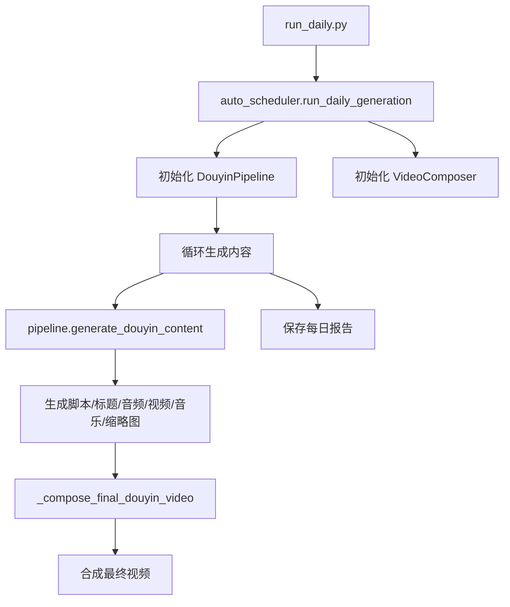

# 视频生成流程与输出文件夹结构分析报告

> 说明：本文件是输出结构重构前的历史分析记录，当前真实结构已收敛为 `output/YYYY-MM-DD/run_<run_id>/001` 这种按 run 分组的目录布局。

## 一、当前流程分析

### 1.1 入口点流程



### 1.2 核心文件调用关系

| 文件 | 职责 | 输出路径控制 |
|------|------|-------------|
| `run_daily.py` | 入口脚本 | 无|
| `auto_scheduler.py` | 调度器 | 报告路径 `output/YYYY-MM-DD/report.json` |
| `douyin_pipeline.py` | 内容生成管道 | 使用 `FileManager.get_content_dir` |
| `file_manager.py` | 文件管理器 | **核心路径控制点** |
| `composer.py` | 视频合成器 | **问题点**: 使用 `output/final/` |
| `speech.py` | 语音API | **问题点**: 使用 `output/audios/` |

---

## 二、当前输出文件夹结构

### 2.1 实际观察到的结构（从日志和文件系统）

```
output/
├── audios/
│ └── 2026-03-25/
│       ├── 收纳整理_223933.mp3
│       └── 美食测评_224136.mp3
├── reports/
│   ├── daily_report_20260325_200826.json
│   ├── daily_report_20260325_223051.json
│   ├── daily_report_20260325_223901.json
│   └── daily_report_20260325_224113.json
└── (final/) - 视频合成后输出到这里
```

### 2.2 FileManager 已设计但未完全实现的结构

根据 [`file_manager.py`](src/utils/file_manager.py:22) 第22-37行的注释：

```
output/
└── YYYY-MM-DD/
    ├── content_1/
    │   ├── script.json
    │   ├── titles.json
    │   ├── audio.mp3
    │   ├── subtitle.srt
    │   ├── video.mp4
    │   ├── cover.jpg
    │   └── score.json
    ├── content_2/
    │   └── ...
    ├── report.json          # 每日汇总
    └── thumbnails/           # 所有封面
```

---

## 三、问题分析

### 3.1 路径不一致的具体位置

#### 问题1: SpeechAPI 音频输出路径

**位置**: [`src/api/speech.py`](src/api/speech.py) 的 `synthesize_to_file` 方法

**现象**: 日志显示音频保存到 `output\audios\2026-03-25\`

**预期**: 应保存到 `output/YYYY-MM-DD/content_X/audio.mp3`

#### 问题2: VideoComposer 最终视频输出路径

**位置**: [`src/video_editor/composer.py`](src/video_editor/composer.py:49) 第49行

```python
self.output_dir = self.settings.output.base_dir / "final"
```

**现象**: 最终视频输出到 `output/final/`

**预期**: 应输出到 `output/YYYY-MM-DD/content_X/final.mp4`

#### 问题3: SubtitleGenerator 字幕输出路径

**位置**: [`src/video_editor/subtitle.py`](src/video_editor/subtitle.py) - 需要检查

#### 问题4: 报告保存路径不一致

**位置**: [`auto_scheduler.py`](auto_scheduler.py:476) 第476-482行

**现象**: 报告保存到 `output/YYYY-MM-DD/report.json`（这是正确的）

**但**: 旧的报告仍然保存到 `output/reports/` 目录

---

## 四、修改方案

### 4.1 目标结构

```
output/
└── 2026-03-25/                    # 按日期组织的文件夹
    ├── content_1/                  # 第1个视频
    │   ├── script.json             # 脚本数据
    │   ├── titles.json             # 备选标题
    │   ├── score.json              # 爆款评分
    │   ├── audio.mp3               # 语音旁白
    │   ├── video.mp4               # AI生成视频
    │   ├── music.mp3               # 背景音乐
    │   ├── subtitle.srt            # 字幕文件
    │   ├── cover.jpg               # 视频封面
    │   └── final.mp4               # 最终合成视频
    ├── content_2/                  # 第2个视频
    │   └── ...
    ├── content_3/
    ├── content_4/
    ├── content_5/
    ├── report.json                 # 每日汇总报告
    └── thumbnails/                 # 所有封面（可选）
```

### 4.2 需要修改的文件

#### 修改1: `src/video_editor/composer.py`

**当前代码** (第46-50行):
```python
def __init__(self):
    self.settings = get_settings()
    self.subtitle_gen = SubtitleGenerator()
    self.output_dir = self.settings.output.base_dir / "final"
    self.output_dir.mkdir(parents=True, exist_ok=True)
```

**修改方案**:
- 添加 `output_dir` 参数，允许外部传入输出目录
- 或者在合成时使用传入的 `output_path` 参数

#### 修改2: `src/api/speech.py`

**需要检查**: `synthesize_to_file` 方法中的输出路径逻辑

**修改方案**: 确保使用 `FileManager.get_content_dir()` 返回的路径

#### 修改3: `src/video_editor/subtitle.py`

**需要检查**: 字幕文件的输出路径

#### 修改4: `douyin_pipeline.py` 中的合成逻辑

**当前代码** (第272-275行):
```python
# 9. 合成最终视频
final_video_path = self._compose_final_douyin_video(pack, duration)
if final_video_path:
    pack.final_video_path = final_video_path
```

**修改方案**: 在 `_compose_final_douyin_video` 方法中指定输出到 `content_dir / "final.mp4"`

---

## 五、实施步骤

### 步骤1: 修改 VideoComposer
- 修改 `compose_final_video` 和 `compose_with_voice_mixing` 方法
- 支持传入 `output_path` 参数，优先使用传入的路径

### 步骤2: 修改 DouyinPipeline._compose_final_douyin_video
- 在调用 `composer.compose_with_voice_mixing` 时传入明确的输出路径
- 输出路径应为 `content_dir / "final.mp4"`

### 步骤3: 检查并修改 SubtitleGenerator
- 确保字幕文件输出到正确的 `content_dir`

### 步骤4: 清理旧的输出目录
- 可选：迁移或清理 `output/audios/`、`output/reports/`、`output/final/` 等旧目录

---

## 六、代码修改清单

| 序号 | 文件 | 修改内容 | 优先级 |
|------|------|----------|--------|
| 1 | `src/video_editor/composer.py` | 修改输出路径逻辑，支持外部指定 | 高 |
| 2 | `src/pipeline/douyin_pipeline.py` | 在合成时指定输出到 content_dir | 高 |
| 3 | `src/video_editor/subtitle.py` | 检查并修改字幕输出路径 | 中 |
| 4 | `src/api/speech.py` | 检查音频输出路径是否正确 | 中 |
| 5 | `auto_scheduler.py` | 确认报告路径正确 | 低 |

---

## 七、验证方法

1. 运行 `python run_daily.py --count 1`
2. 检查 `output/YYYY-MM-DD/content_1/` 目录是否包含所有文件：
   - script.json
   - titles.json
   - score.json
   - audio.mp3
   - video.mp4 (如果API配额足够)
   - music.mp3 (如果启用)
   - subtitle.srt
   - cover.jpg
   - final.mp4 (合成后的最终视频)
3. 检查 `output/YYYY-MM-DD/report.json` 是否存在
